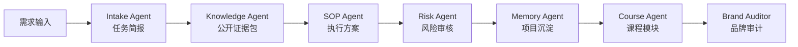
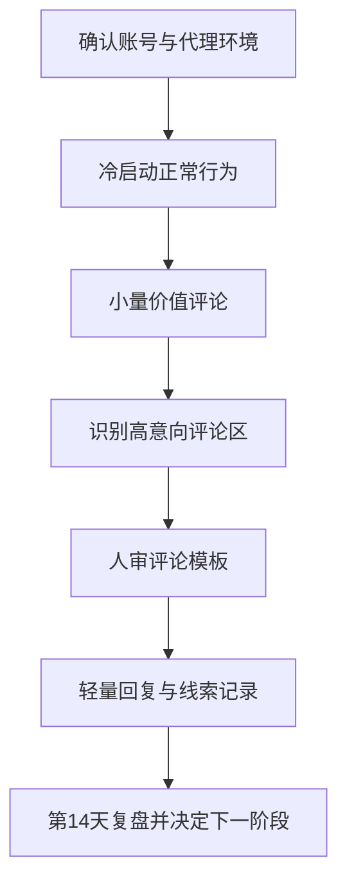
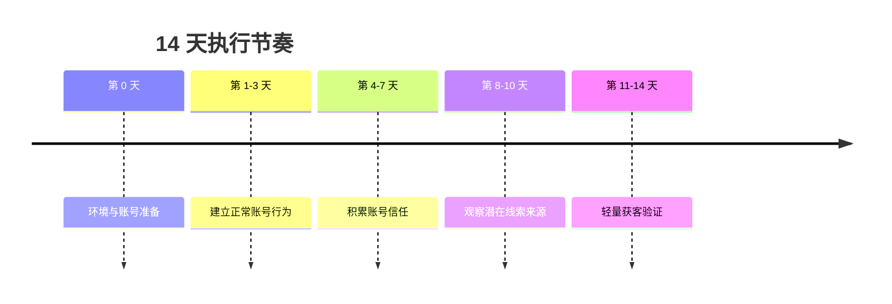
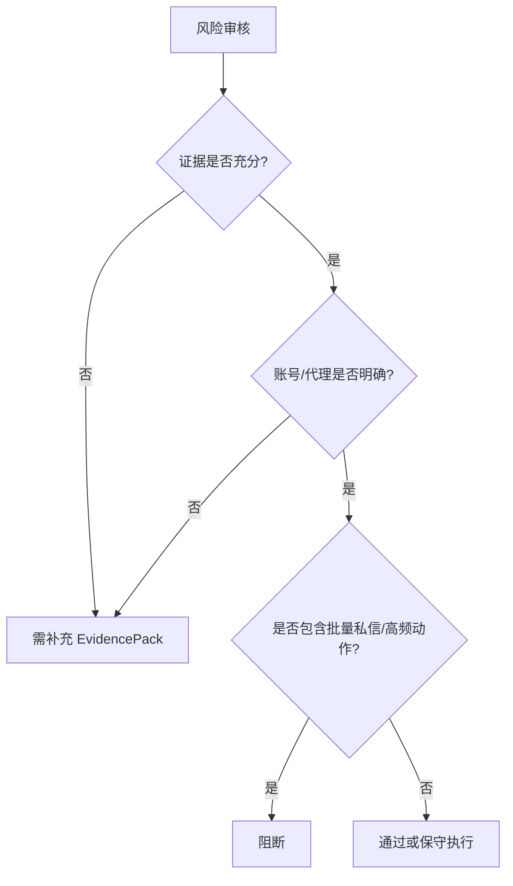
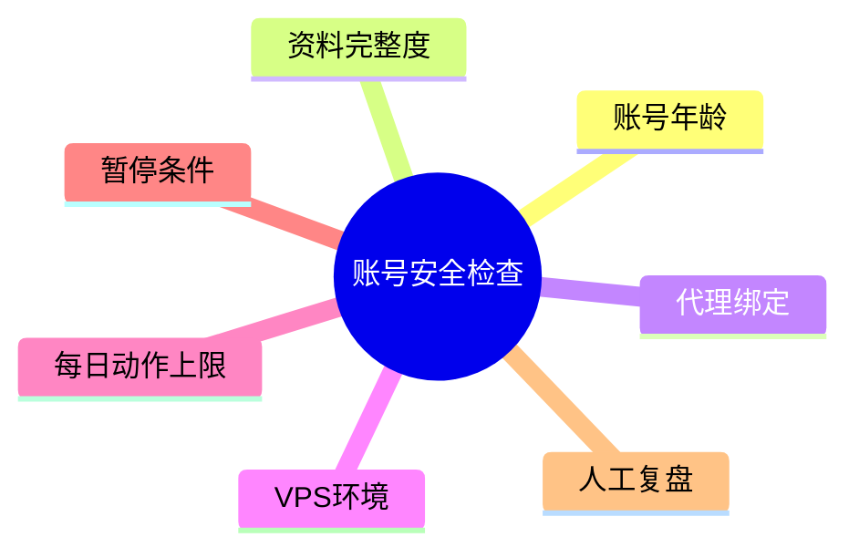

# AIvaMax Instagram 账号安全与评论区轻获客 14 天 SOP

## 可视化流程图

### 多智能体执行链路

### SOP 执行流程

### 14 天节奏图

### 风险审核决策图

### 结构示意图

## 1. 任务简报
- 对外品牌: AIvaMax
- 产品/课程: AI 工具课
- 账号数量: 30
- 账号阶段: new
- 风险偏好: conservative
- 关键词: 待定义

## 2. 内部依据映射
| 依据 ID | 类型 | 可信度 | 公开摘要 |
|---|---|---|---|
| PUB-563756B75641 | knowledge_fact | high | ...y. 7. Grouping by Platform Users managing multiple platforms may group accounts like: Instagram automation accounts Facebook marketing accounts TikTok growth accounts Twitter engagement accounts This simplifies campaign configuration across different social ne... |
| PUB-E8A3A66C8C1C | knowledge_fact | high | ...hat to publish, where , and when before everyone else does. This is where most tools fail. AIvaMax Advanced Content Explorer was built to solve that exact problem. Not as a scraper. Not as a hashtag tool. But as a real-time content intelligence engine design... |
| PUB-A8A271AD9CE3 | knowledge_fact | high | How to Warm Up Instagram Accounts Using AIvaMax 2026-02-04 Overview Managing multiple Instagram accounts can be a nightmare if they get suspended frequently. Losing access to accounts kills momentum and profits, even if your content is top-notch. The solutio... |
| PUB-3E1F0EC78506 | knowledge_fact | high | AIvaMax YouTube Campaigns 2026-02-11 Automating Engagement, Growth, and Visibility at Scale (2026 Guide) Introduction YouTube in 2026 is no longer just a video platform. It is a discovery engine , a search engine , and a conversion layer — all at once. The c... |
| PUB-E54BBBE75E4B | knowledge_fact | high | AIvaMax AI Templates Guide: From Auto Posting to Context-Aware Engagement 2026-01-30 Introduction AI Templates under AIvaMax Content Intelligence Engine are one of the most powerful — and most misunderstood — features in the entire system. Many users assume AI Templa... |
| PUB-5ABE983F5DA6 | knowledge_fact | high | ... 2026-01-28 Overview When managing large numbers of social media accounts, especially Instagram, proxy isolation becomes one of the most important factors for long-term account safety. Many users ask: “Can AIvaMax guarantee that only one account uses one pro... |
| PUB-6D5641E14CDB | knowledge_fact | high | ... 2026-01-28 Overview When managing large numbers of social media accounts, especially Instagram, proxy isolation becomes one of the most important factors for long-term account safety. Many users ask: “Can AIvaMax guarantee that only one account uses one pro... |
| PUB-6D7BFCEE513F | knowledge_fact | high | ... Account Manager Go to AIvaMax Dashboard Click Account Manager Select the platform (Instagram, Facebook, Twitter, TikTok, etc.) Step 2: Edit Account Select the account Click the Edit (pencil icon) Locate the Proxy Settings section Step 3: Enter Proxy Details... |

## 3. 账号与环境清单
- 执行前必须记录账号年龄、登录状态、资料完整度和历史活跃情况。
- 执行前必须记录代理和 VPS 状态。
- 未知字段不允许作为放量依据，只能进入保守验证。

## 4. 代理与分组计划
- 默认采用一账号一代理。
- 执行前检查并避免重复代理绑定。
- 按账号年龄、代理、VPS、风险等级和项目目的分组。

## 5. 14 天执行节奏
| 阶段 | 目标 | 动作 | 限制 |
|---|---|---|---|
| 第 0 天 | 环境与账号准备 | 绑定代理、检查重复代理、分组账号、准备关键词、确认人工审核负责人。 | 不做任何外联动作 |
| 第 1-3 天 | 建立正常账号行为 | 浏览信息流、观看 Reels/Stories、轻量点赞、自然停顿，不发销售评论。 | 每账号每天 0-1 条非推广评论 |
| 第 4-7 天 | 积累账号信任 | 继续冷启动，在相关帖子下做人审价值评论，观察账号健康。 | 每账号每天 0-1 条价值评论 |
| 第 8-10 天 | 观察潜在线索来源 | 监控目标帖子和高意向评论，分类购买意图和问题意识。 | 每个健康账号每天 1-2 条评论 |
| 第 11-14 天 | 轻量获客验证 | 测试已审核评论模板，只回复相关互动，准备复盘数据。 | 每个健康账号每天 2-3 条评论；禁止批量私信 |

## 6. 评论区轻获客规则
- 优先寻找高意向信号，例如价格、链接、怎么做、是否安全、工具推荐等。
- 每条评论都必须结合目标帖子、产品卖点和账号阶段做人审。
- 避免重复模板，优先使用价值型评论，不做硬广式推销。

## 7. 私信跟进边界
- 前 14 天禁止批量私信。
- 只有当用户明确互动或主动询问时，才允许有限跟进。
- 是否进入私信放量阶段，必须放到第 14 天复盘后决定。

## 8. 暂停条件
- 登录验证、验证码、动作限制或评论失败率异常。
- 代理失效或重复代理绑定。
- 出现负面反馈、评论被隐藏、重复删除或疑似垃圾互动。
- 任一账号超过当日计划，次日降级为观察状态。

## 9. 每日记录
| 日期 | 活跃账号 | 评论/内容数 | 回复 | 线索 | 风险事件 | 调整 |
|---|---:|---:|---:|---:|---|---|

## 10. 第 14 天复盘
- 保持活跃的账号:
- 暂停的账号:
- 最有效的来源/选题:
- 最有效的人审模板:
- 合格线索:
- 风险事件:
- 下一阶段决策:
