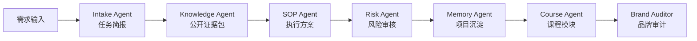
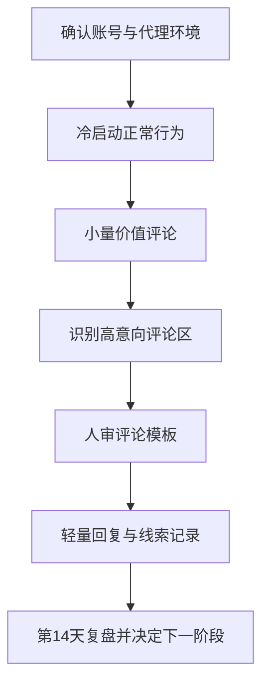
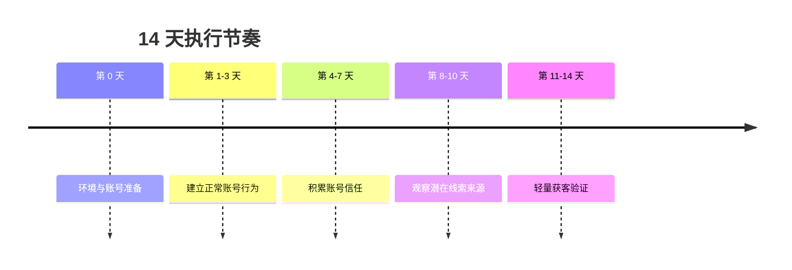
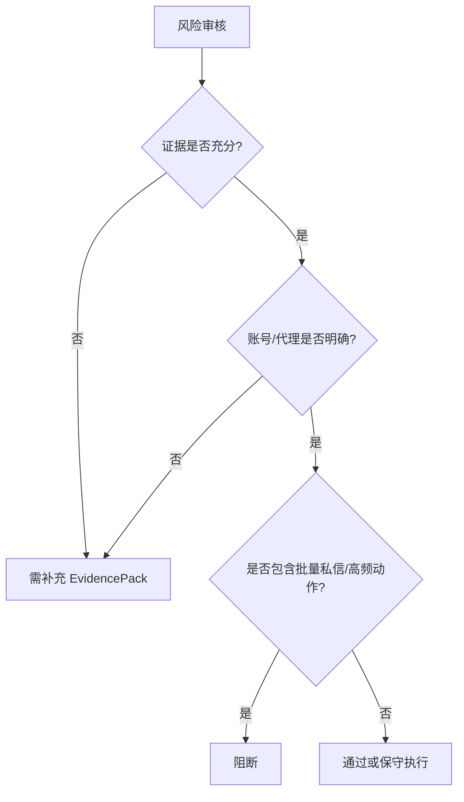
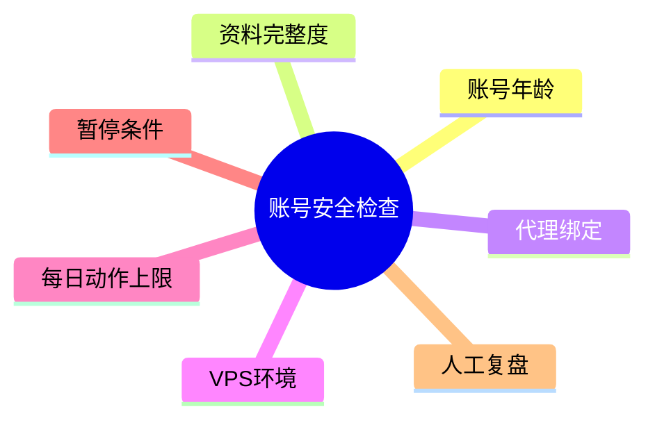

# AIvaMax Instagram 账号安全与评论区轻获客 14 天 SOP 深度执行手册

## 0. 使用说明
这份文档是执行手册，不是自动化放量指令。它的用途是把营销需求转成可检查、可执行、可复盘的保守验证流程。任何真实账号动作都必须经过人工确认，并且必须以账号安全、平台合规和品牌安全为前提。

本手册适合团队内部执行、学员训练和项目复盘。它不适合直接复制成批量动作，也不适合在账号环境、代理资源、素材质量和人工审核人员都未知的情况下执行。

## 可视化流程图

### 多智能体执行链路

### SOP 执行流程

### 14 天节奏图

### 风险审核决策图

### 结构示意图

## 1. 项目背景与目标拆解
- 对外品牌: AIvaMax
- 平台: instagram
- 产品/课程: AI 工具课
- 账号数量: 30
- 账号阶段: new
- 执行周期: 14 天
- 风险偏好: conservative
- 关键词: 待定义

项目目标不是在 14 天内追求最大动作量，而是验证三个问题：账号是否稳定、目标评论区或内容方向是否有真实意向、轻量互动是否能带来可复盘的线索。只要其中任一项数据不足，下一阶段都应继续保守验证，而不是直接放量。

## 2. 适用对象与不适用场景
适用对象:
- 新账号或账号成熟度未知的冷启动项目。
- 需要建立评论区轻获客、内容矩阵或轻量互动 SOP 的团队。
- 需要把内部知识库转成培训材料、执行手册和复盘模板的场景。

不适用场景:
- 需要立即大规模私信、刷评论、刷互动的项目。
- 没有代理/账号/素材检查记录的项目。
- 无人负责人工审核、无人记录风险事件的项目。
- 希望把自动化工具当成无监督增长机器的项目。

## 3. 执行前检查清单
### 账号与环境
- 记录账号年龄、资料完整度、登录状态、历史活跃和最近异常。
- 确认代理绑定，默认一账号一代理，不把多个高风险账号放在同一代理上。
- 记录 VPS 或设备环境，避免短时间频繁切换登录环境。
- 给账号分组: 新号、半熟号、老号、异常观察组。

### 素材与人员
- 明确产品卖点、目标用户、禁用表达和人工审核负责人。
- 准备价值型评论框架，不准备批量复制模板。
- 准备每日记录表、风险事件表和第 7/14 天复盘表。
- 所有外发评论、内容、CTA 都必须先经过人工检查。

## 4. 账号分层策略
| 账号层级 | 判断方式 | 允许动作 | 禁止动作 | 复盘重点 |
|---|---|---|---|---|
| 新号 | 新注册、历史活跃少、资料刚完善 | 浏览、观看、轻点赞、少量价值评论 | 批量评论、批量私信、重复模板 | 是否触发验证、动作失败、评论隐藏 |
| 半熟号 | 有一定历史活跃，近期稳定 | 小量评论、内容测试、轻量互动 | 高频动作、跨账号复制话术 | 回复质量、账号稳定、负面反馈 |
| 老号 | 长期稳定、有真实内容或互动 | 可做更完整的内容验证 | 未复盘前仍不放量 | 是否能承接线索、是否适合扩量 |
| 异常组 | 有验证、限流、代理异常、负面反馈 | 观察、暂停、修复资料 | 所有外联动作 | 异常原因和恢复条件 |

## 5. 14 天逐日执行表
| 日期 | 目标 | 具体动作 | 上限 | 观察指标 | 当日产出 |
|---|---|---|---|---|---|
| 第 1 天 | 账号与环境确认 | 逐个记录账号年龄、资料完整度、登录状态、代理绑定、VPS 环境和历史活跃。 | 不做评论和私信 | 登录是否稳定、是否有验证、代理是否重复 | 账号资产与环境检查表 |
| 第 2 天 | 正常行为冷启动 | 浏览信息流、观看 Reels/Stories、少量点赞收藏，不触发营销表达。 | 每账号 0 条销售评论 | 页面加载、动作失败、验证码、账号异常 | 冷启动行为记录 |
| 第 3 天 | 轻量兴趣画像 | 围绕目标赛道浏览内容，记录高频问题和潜在关键词。 | 每账号最多 1 条非推广评论 | 相关帖子质量、评论区真实度 | 目标帖子与关键词清单 |
| 第 4 天 | 价值评论准备 | 为 3 类目标帖子写价值型评论框架，全部进入人工审核。 | 不复制同一模板 | 话术是否像硬广、是否过度承诺 | 人审评论框架 |
| 第 5 天 | 小量价值评论 | 只在高度相关帖子下发布已审核价值评论。 | 每健康账号 0-1 条 | 评论是否展示、是否被隐藏、是否有回复 | 评论发布记录 |
| 第 6 天 | 互动信号观察 | 记录回复、点赞、主页访问和负面反馈，不主动私信。 | 禁止批量跟进 | 回复质量、潜在线索类型 | 互动信号表 |
| 第 7 天 | 中期复盘 | 暂停异常账号，保留有效帖子来源，淘汰弱话术。 | 不增加动作量 | 账号稳定性、回复率、风险事件 | 第 7 天复盘表 |
| 第 8 天 | 高意向评论区识别 | 寻找出现价格、链接、教程、工具、安全等问题的评论区。 | 每账号 1-2 条评论 | 需求明确度、帖子相关性 | 高意向信号清单 |
| 第 9 天 | 话术微调 | 把有效评论改成 2-3 个不同表达，保持价值优先。 | 不跨账号复制同一表达 | 重复度、自然度 | 评论变体清单 |
| 第 10 天 | 轻量获客验证 | 对明确相关帖子继续小量评论，记录回复与线索质量。 | 每健康账号 1-2 条 | 回复率、被隐藏率、负面反馈 | 轻量获客记录 |
| 第 11 天 | 有限跟进判断 | 只对主动互动或明确询问用户做人工回复，不做批量私信。 | 禁止批量 DM | 用户是否明确请求更多信息 | 跟进边界记录 |
| 第 12 天 | 风险压力检查 | 检查代理、账号动作失败率、评论删除、隐藏、异常提醒。 | 异常账号暂停 24-48 小时 | 风险事件数量和连续性 | 风险检查表 |
| 第 13 天 | 复盘资料准备 | 汇总账号、评论、回复、线索、风险事件和有效帖子来源。 | 不新增高风险动作 | 数据完整性 | 最终复盘材料 |
| 第 14 天 | 最终复盘与下一阶段决策 | 判断继续保守验证、优化话术、暂停账号或小幅扩量。 | 放量必须人工批准 | 账号存活、合格线索、风险事件 | 第 14 天决策表 |

## 6. 评论区轻获客话术框架
本系统不生成垃圾评论，也不鼓励复制模板。这里只提供人审结构:

| 场景 | 结构 | 示例方向 | 人审标准 |
|---|---|---|---|
| 用户问工具 | 先确认问题，再给判断维度 | “如果你主要卡在 X，可以先看 Y 指标。” | 不直接硬推，不夸张承诺 |
| 用户问价格 | 先解释适用对象，再引导比较 | “价格要看账号规模和目标，不建议只看单价。” | 不虚构价格，不诱导成交 |
| 用户问教程 | 先给步骤框架，再邀请进一步交流 | “可以先按 账号-环境-内容-复盘 四步拆。” | 不批量私信，只响应明确需求 |
| 用户表达痛点 | 先共情，再给一个低风险建议 | “先把动作量降下来，确认代理和账号分组。” | 不制造焦虑，不承诺结果 |

## 7. 高意向信号识别表
| 信号类型 | 关键词/行为 | 意向判断 | 动作建议 |
|---|---|---|---|
| 价格信号 | price、cost、多少钱、贵不贵 | 有预算或比较意图 | 记录，不直接报价承诺 |
| 教程信号 | how、教程、怎么做、流程 | 需要方法 | 回复框架型建议 |
| 工具信号 | tool、software、automation、工具 | 正在找方案 | 给选择维度，不硬推 |
| 安全信号 | safe、ban、封号、代理 | 风险意识强 | 强调保守验证和账号安全 |
| 链接信号 | link、demo、案例 | 可能进入线索阶段 | 只在明确请求后有限跟进 |

## 8. 风险分级与暂停机制
| 风险级别 | 表现 | 处理 |
|---|---|---|
| 低 | 个别评论无回复、互动少 | 继续观察，优化话术 |
| 中 | 评论被隐藏、动作失败、回复质量低 | 降低动作量，暂停异常账号 |
| 高 | 验证码、登录异常、代理失效、负面反馈集中 | 立即暂停 24-48 小时并复盘 |
| 阻断 | 批量私信、高频评论、重复模板被识别 | 停止执行，重新设计 SOP |

## 9. 异常处理 SOP
### 验证码或登录验证
立即暂停该账号所有外联动作，记录发生时间、代理、设备、最近动作。恢复前只允许检查资料和环境，不允许继续评论或私信。

### 动作限制或限流
停止该账号当天动作，把它放入异常观察组。复盘是否动作过密、话术重复、帖子相关性不足或代理不稳定。

### 代理失效或重复绑定
暂停相关账号，确认是否存在多个账号共享同一代理。代理问题未解决前，不允许进入第 8-14 天轻量获客阶段。

### 负面反馈或评论被隐藏
检查评论是否像广告、是否重复、是否与帖子不相关。出现连续负面反馈时，先改话术框架，再恢复低频测试。

### 回复率异常低
不要直接增加评论量。先检查目标帖子选择、评论价值、产品匹配度和用户意图，再决定是否继续。

## 10. 人工审核标准
每条评论或跟进内容必须满足:
- 与目标帖子和用户问题相关。
- 不夸张承诺，不虚构案例，不制造焦虑。
- 不出现批量复制痕迹。
- 不绕过平台规则，不诱导违规行为。
- 能解释为什么这条内容对用户有价值。

审核人必须给出三种结果之一：通过、修改后通过、拒绝。拒绝内容要记录原因，作为下一轮话术优化依据。

## 11. 每日记录模板
| 日期 | 账号组 | 动作数 | 回复 | 线索 | 风险事件 | 调整 |
|---|---|---:|---:|---:|---|---|
| | 新号组 | | | | | |
| | 半熟号组 | | | | | |
| | 老号组 | | | | | |

## 12. 第 7 天中期复盘
第 7 天不做放量决策，只判断是否允许进入第 8-14 天轻量验证。复盘问题:
- 哪些账号稳定，哪些账号需要暂停？
- 哪些目标帖子或内容方向最相关？
- 哪些评论框架有回复，哪些像广告？
- 代理和环境是否还有未知字段？
- 是否出现任何需要阻断的风险？

## 13. 第 14 天最终复盘
第 14 天输出下一阶段建议:
- 继续保守验证: 数据不足但账号安全。
- 优化话术: 有互动但线索质量弱。
- 暂停项目: 风险过高或账号异常集中。
- 小幅扩量: 账号稳定、回复质量可接受、人工审核机制完整。

## 14. 证据转译区
| 公开依据 ID | 类型 | 可信度 | 转译成执行策略 |
|---|---|---|---|
| PUB-563756B75641 | knowledge_fact | high | 用于确认账号安全、代理隔离和冷启动节奏，转译为先检查环境、再限制动作量。 |
| PUB-E8A3A66C8C1C | knowledge_fact | high | 用于确认内容和模板需要人审，转译为先准备素材与话术框架，再进入小批量验证。 |
| PUB-A8A271AD9CE3 | knowledge_fact | high | 用于确认账号安全、代理隔离和冷启动节奏，转译为先检查环境、再限制动作量。 |
| PUB-3E1F0EC78506 | knowledge_fact | high | 用于确认互动动作必须保守，转译为低频评论、只跟进明确互动用户。 |
| PUB-E54BBBE75E4B | knowledge_fact | high | 用于确认内容和模板需要人审，转译为先准备素材与话术框架，再进入小批量验证。 |
| PUB-5ABE983F5DA6 | knowledge_fact | high | 用于确认账号安全、代理隔离和冷启动节奏，转译为先检查环境、再限制动作量。 |
| PUB-6D5641E14CDB | knowledge_fact | high | 用于确认账号安全、代理隔离和冷启动节奏，转译为先检查环境、再限制动作量。 |
| PUB-6D7BFCEE513F | knowledge_fact | high | 用于确认账号安全、代理隔离和冷启动节奏，转译为先检查环境、再限制动作量。 |
| PUB-45E04ECB54B1 | knowledge_fact | high | 用于确认账号安全、代理隔离和冷启动节奏，转译为先检查环境、再限制动作量。 |
| PUB-80D7FA39BD4D | knowledge_fact | high | 用于确认账号安全、代理隔离和冷启动节奏，转译为先检查环境、再限制动作量。 |

## 15. 下一阶段放量条件
只有满足以下条件，才允许讨论下一阶段:
- 账号环境和代理资源已明确。
- 14 天内没有连续高风险事件。
- 价值型评论或内容方向有稳定回复。
- 人工审核流程可以持续执行。
- 每日记录和复盘评分完整。

如果任一条件不满足，下一阶段不是放量，而是继续补充资料、降低动作量或重新设计目标场景。

## 16. 执行检查表
# AIvaMax 深度 SOP 执行检查表

## 1. 账号检查
| 检查项 | 标准 | 记录 |
|---|---|---|
| 账号年龄 | 新号、半熟号、老号必须分层 | |
| 资料完整度 | 头像、简介、链接、基础内容完整 | |
| 登录状态 | 无异常验证、无频繁掉线 | |
| 历史活跃 | 有正常浏览、点赞、发布或互动记录 | |

## 2. 环境检查
| 检查项 | 标准 | 记录 |
|---|---|---|
| 代理绑定 | 默认一账号一代理 | |
| 重复代理 | 不允许重复绑定未评估的账号 | |
| VPS/设备 | 登录环境稳定，避免频繁切换 | |
| 操作窗口 | 明确每日执行时段和暂停时间 | |

## 3. 素材与话术检查
| 检查项 | 标准 | 记录 |
|---|---|---|
| 目标帖子来源 | 与产品/课程强相关 | |
| 评论框架 | 价值优先，不硬推 | |
| 禁止动作 | 批量私信、高频评论、复制模板均禁止 | |
| 人工审核 | 每条可外发内容必须有人审 | |

## 4. 执行前确认
- 风险结论如果是 `revise`，只能作为文档和保守验证使用，不能放量。
- 任何账号出现验证、限流、负面反馈，先暂停再复盘。
- 执行人员每天必须填写每日记录和风险事件。

## 17. 复盘评分表
# AIvaMax 深度 SOP 复盘评分表

## 1. 评分维度
| 维度 | 0 分 | 1 分 | 2 分 | 得分 |
|---|---|---|---|---|
| 账号安全 | 多个账号异常或未记录 | 有少量异常但有记录 | 账号稳定且记录完整 | |
| 环境稳定 | 代理/VPS 不明 | 部分明确 | 全部明确且无重复风险 | |
| 动作合规 | 有高频或批量动作 | 基本保守但记录不足 | 完全按上限执行 | |
| 内容质量 | 明显模板化或硬广 | 有价值但不够贴合 | 贴合场景且人审通过 | |
| 线索质量 | 无相关互动 | 有回复但意向弱 | 有明确需求或主动询问 | |
| 复盘完整度 | 无数据 | 数据不完整 | 每日记录完整 | |

## 2. 第 7 天中期复盘
- 是否有账号异常:
- 哪类帖子或内容最相关:
- 哪些评论/内容应暂停:
- 哪些字段仍然未知:
- 是否允许进入第 8-14 天轻量验证:

## 3. 第 14 天最终复盘
- 账号存活率:
- 评论/内容成功率:
- 回复率:
- 合格线索数:
- 风险事件:
- 下一阶段建议: 继续保守验证 / 优化话术 / 暂停项目 / 小幅扩量

## 4. 放量条件
只有当账号环境明确、风险事件可控、回复质量稳定、人工审核机制存在时，才允许讨论下一阶段放量。放量不是默认结果，而是复盘后的人工决策。

