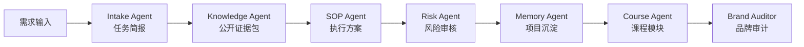
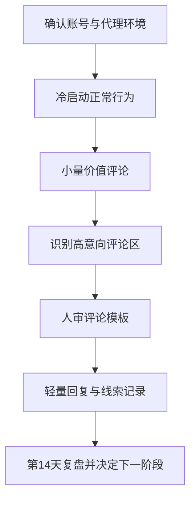
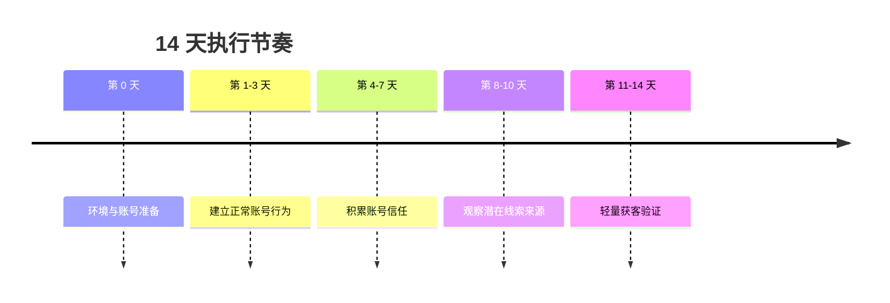
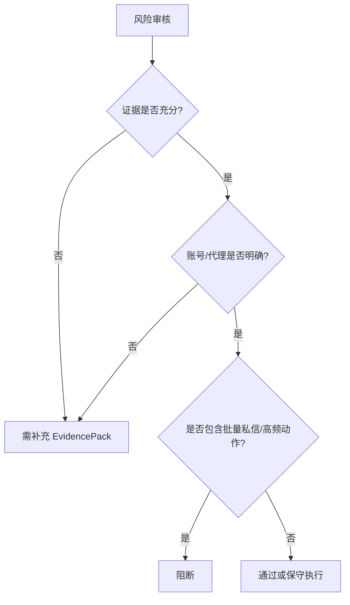
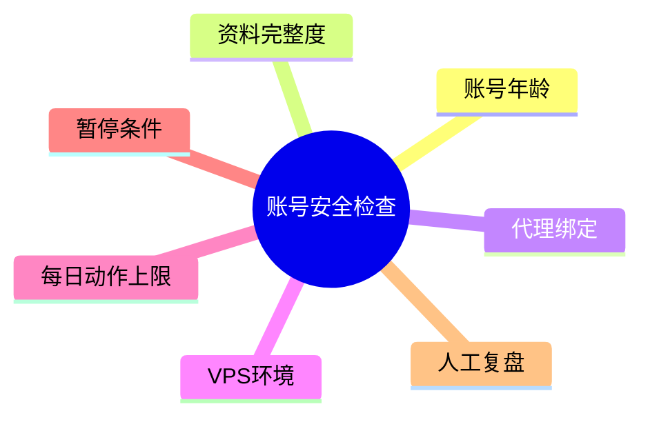

# AIvaMax Instagram 账号安全与评论区轻获客 14 天 SOP 公开课程版 SOP

## 1. 平台打法总览
视觉信任、轻互动、主页承接和评论区信号驱动的平台。

## 可视化流程图

### 多智能体执行链路

### SOP 执行流程

### 14 天节奏图

### 风险审核决策图

### 结构示意图

## 2. 平台用户画像
- 课程/工具兴趣用户
- 内容创作者
- 小团队运营者
- 正在比较解决方案的轻咨询用户

## 3. 内容入口与转化路径
- 主要入口: Reels, 帖子评论区, Stories, 主页简介, 精选集合
- 转化路径: 内容曝光 -> 评论区价值回应 -> 主页信任判断 -> 用户主动询问 -> 人工跟进。

## 4. 红黄绿风险边界
| 分层 | 含义 | 典型动作 | 处理策略 |
|---|---|---|---|
| 绿色 | 可作为公开课程与日常 SOP 的稳定动作。 | 内容准备、排程、人工审核、正常互动、每日记录、复盘。 | 继续执行，并保留记录。 |
| 黄色 | 可以做小范围验证，但必须有人审、上限和暂停条件。 | 自动化辅助、批量账号管理、评论/私信测试、外部素材导入、跨账号内容变体。 | 降级执行，先小批量测试，异常即暂停。 |
| 红色 | 不进入公开课程，不作为推荐执行动作。 | 垃圾内容、虚假互动、未经同意的高频触达、平台限制对抗、账号欺骗。 | 放弃或改写为合规的人工审核流程。 |

## 5. 公开课程可讲内容
- 如何做平台偏好分析、用户画像和内容入口选择。
- 如何做账号安全检查、素材准备、人工审核和每日复盘。
- 如何识别高意向评论、明确提问和主动互动信号。
- 如何设置暂停、降级、恢复和第 7/14 天复盘机制。

## 6. 团队私有资料边界
以下内容只进入团队私有项目资料，不放进公开课程讲义:
- 账号批次、代理/VPS/环境参数。
- 每日执行参数、实验假设和异常事件。
- 未验证的话术、素材失败记录和恢复过程。
- 团队复盘结论与下一轮测试条件。

## 7. 不进入公开课的内容
- 平台限制对抗细节。
- 未经验证的账号批次数据。
- 可被误解为高频触达或机械互动的执行细节。
- 学员无法自行判断风险的团队私有记录。

## 8. 暂停、降级、恢复、复盘机制
| 状态 | 触发信号 | 处理动作 |
|---|---|---|
| 暂停 | 登录验证、动作失败、负面反馈、异常提醒 | 停止当日动作，记录账号、时间、现象 |
| 降级 | 回复质量低、隐藏率高、素材重复 | 回到浏览、内容准备和人工审核 |
| 恢复 | 连续观察稳定，且风险事件可解释 | 小范围恢复，不直接扩大动作规模 |
| 复盘 | 第 7 天和第 14 天 | 判断继续、优化、暂停或换平台入口 |

## 9. 证据转译区
| 依据 ID | 类型 | 可信度 | 公开策略解释 |
|---|---|---|---|
| PUB-563756B75641 | knowledge_fact | high | 用于确认账号安全、代理隔离和冷启动节奏，转译为先检查环境、再限制动作量。 |
| PUB-E8A3A66C8C1C | knowledge_fact | high | 用于确认内容和模板需要人审，转译为先准备素材与话术框架，再进入小批量验证。 |
| PUB-A8A271AD9CE3 | knowledge_fact | high | 用于确认账号安全、代理隔离和冷启动节奏，转译为先检查环境、再限制动作量。 |
| PUB-3E1F0EC78506 | knowledge_fact | high | 用于确认互动动作必须保守，转译为低频评论、只跟进明确互动用户。 |
| PUB-E54BBBE75E4B | knowledge_fact | high | 用于确认内容和模板需要人审，转译为先准备素材与话术框架，再进入小批量验证。 |
| PUB-5ABE983F5DA6 | knowledge_fact | high | 用于确认账号安全、代理隔离和冷启动节奏，转译为先检查环境、再限制动作量。 |
| PUB-6D5641E14CDB | knowledge_fact | high | 用于确认账号安全、代理隔离和冷启动节奏，转译为先检查环境、再限制动作量。 |
| PUB-6D7BFCEE513F | knowledge_fact | high | 用于确认账号安全、代理隔离和冷启动节奏，转译为先检查环境、再限制动作量。 |

## 10. 课程作业
- 为 Instagram 写出 3 个内容入口和 3 个互动入口。
- 写一份账号安全检查表。
- 写一份第 7 天复盘表。
- 把一个黄色动作改写成人工审核流程。
