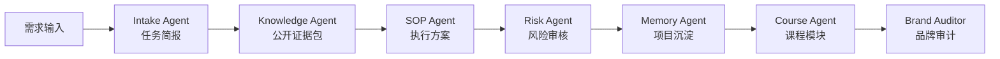
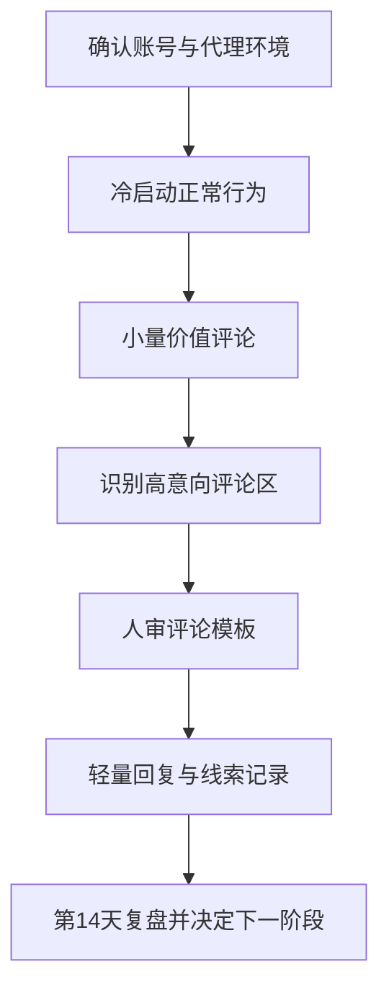
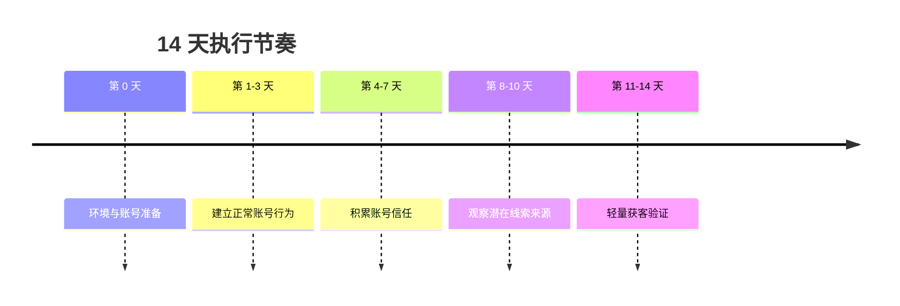
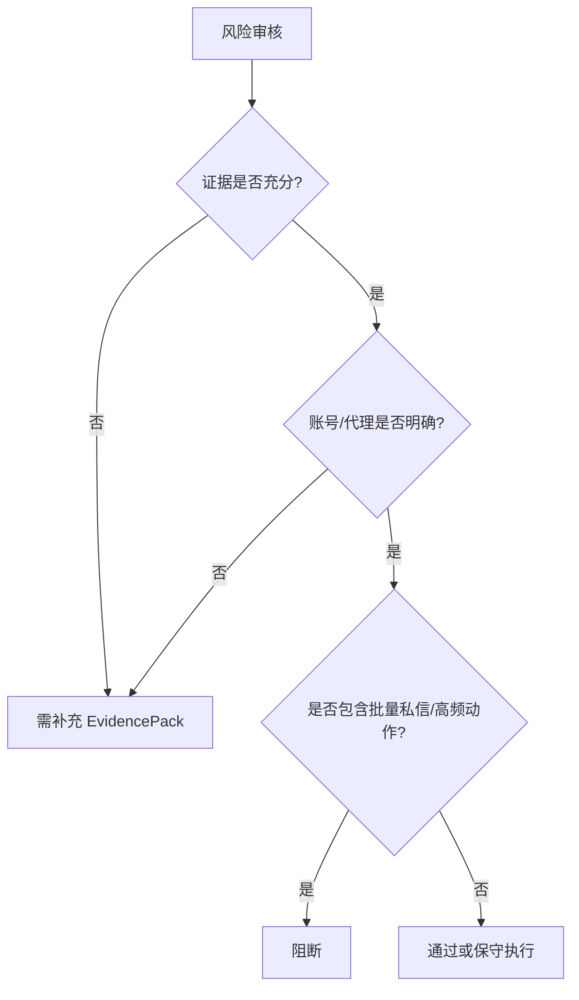
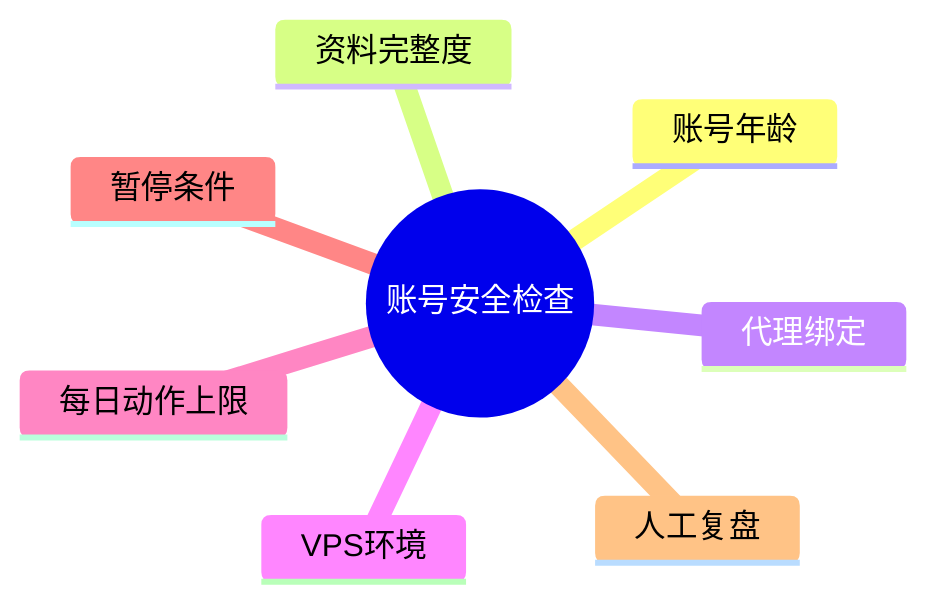

# AIvaMax Instagram 账号安全与评论区轻获客 14 天 SOP 课程级公开执行手册

## 1. 课程定位
这份手册是 AIvaMax 的公开课程交付版，用来训练学员把一个 Instagram 营销需求，拆成有平台逻辑、有风险边界、有人审动作、有复盘证据的执行方案。它不是放量脚本，也不是平台规则的照本宣科摘要，而是一套适合课堂讲解、学员练习和项目复盘的标准手册。

## 2. 项目背景与目标拆解
- 对外品牌: AIvaMax
- 平台: Instagram
- 产品/课程: AI 工具课
- 账号数量: 30
- 账号阶段: new
- 风险偏好: conservative
- 核心目标: 先建立账号与内容的基础信任，再用评论区信号识别轻线索，最后通过人工复盘决定是否进入下一阶段。

## 3. 平台打法逻辑
视觉信任、轻互动、主页承接和评论区信号驱动的平台。

### 平台偏好
- Reels 与短视频节奏
- 评论区问题识别
- 主页信任资产
- Stories 轻触达
- 收藏与转发信号

### 用户画像
- 课程/工具兴趣用户
- 内容创作者
- 小团队运营者
- 正在比较解决方案的轻咨询用户

### 内容入口与转化路径
- 主要入口: Reels, 帖子评论区, Stories, 主页简介, 精选集合
- 转化路径: 内容曝光 -> 评论区价值回应 -> 主页信任判断 -> 用户主动询问 -> 人工跟进。

## 4. 图文流程与课堂讲法
## 可视化流程图

### 多智能体执行链路

### SOP 执行流程

### 14 天节奏图

### 风险审核决策图

### 结构示意图

### 图后解释
- 多智能体流程图: 用来说明从需求到课程资产不是一次性写稿，而是经过简报、证据、SOP、风险、沉淀和审计。
- SOP 执行流程图: 用来说明账号安全、内容准备、轻量互动、线索识别和复盘之间的顺序关系。
- 14 天节奏图: 用来提醒学员，前期重点不是动作量，而是稳定性、相关性和记录完整度。
- 风险审核图: 用来解释 `revise` 是补齐条件的信号，不是失败；`block` 是停止或改写场景。
- 结构示意图: 用来带学员检查账号、环境、动作上限、暂停条件和复盘责任人。

### 课堂讲法
讲师先让学员看图，再让学员反推每个节点需要什么输入。比如“账号与代理环境”节点，学员必须能回答账号年龄、资料完整度、环境稳定性、素材准备、人审负责人五个问题。如果回答不完整，就不能进入扩大动作的讨论。

## 5. 适用对象与不适用场景
### 适用对象
- 已经有基础产品、课程或服务，需要用 Instagram 做轻量获客验证的团队。
- 需要训练执行人员理解账号安全、内容入口和风险暂停机制的课程学员。
- 需要把矩阵软件能力转成 SOP、作业和复盘资产的运营负责人。

### 不适用场景
- 账号环境、代理资源、素材质量和人审负责人都未知，却希望直接放大动作量。
- 希望绕过平台限制、制造虚假互动或进行未经同意的高频触达。
- 没有每日记录、没有风险复盘、没有暂停机制的临时执行。

## 6. 执行前准备清单
| 模块 | 必须确认 | 合格标准 | 课堂提醒 |
|---|---|---|---|
| 账号 | 年龄、资料、登录、历史活跃 | 能分为新号、半熟号、老号 | 新号不能用老号标准判断 |
| 环境 | 代理、VPS、设备指纹、登录稳定性 | 绑定关系明确、异常可追溯 | 未知环境只允许保守验证 |
| 内容 | 主页承接、内容支柱、评论框架 | 人审通过、与目标用户相关 | 不复制模板，不硬推 |
| 人员 | 执行、审核、复盘负责人 | 每天有人记录和判断 | 没有人审就不进入外发动作 |
| 风险 | 暂停、降级、恢复条件 | 执行前写清楚 | 异常先停，不边做边猜 |

## 7. 账号分层策略
| 分层 | 判断标准 | 公开课建议动作 | 暂停条件 |
|---|---|---|---|
| 新号 | 资料或历史行为不足 | 浏览、内容准备、极少量价值互动 | 验证、限制、失败率异常 |
| 半熟号 | 有稳定登录和基础内容 | 小范围内容/评论验证 | 回复质量低、隐藏率高、负面反馈 |
| 老号 | 有长期内容和互动记录 | 经人审的小批量测试 | 连续异常、内容质量下降、用户反馈变差 |

## 8. 14 天逐日讲解
| 日期 | 教学目标 | 学员动作 | 执行上限 | 观察指标 | 交付物 |
|---|---|---|---|---|---|
| 第 1 天 | 账号与环境确认 | 逐个记录账号年龄、资料完整度、登录状态、代理绑定、VPS 环境和历史活跃。 | 不做评论和私信 | 登录是否稳定、是否有验证、代理是否重复 | 账号资产与环境检查表 |
| 第 2 天 | 正常行为冷启动 | 浏览信息流、观看 Reels/Stories、少量点赞收藏，不触发营销表达。 | 每账号 0 条销售评论 | 页面加载、动作失败、验证码、账号异常 | 冷启动行为记录 |
| 第 3 天 | 轻量兴趣画像 | 围绕目标赛道浏览内容，记录高频问题和潜在关键词。 | 每账号最多 1 条非推广评论 | 相关帖子质量、评论区真实度 | 目标帖子与关键词清单 |
| 第 4 天 | 价值评论准备 | 为 3 类目标帖子写价值型评论框架，全部进入人工审核。 | 不复制同一模板 | 话术是否像硬广、是否过度承诺 | 人审评论框架 |
| 第 5 天 | 小量价值评论 | 只在高度相关帖子下发布已审核价值评论。 | 每健康账号 0-1 条 | 评论是否展示、是否被隐藏、是否有回复 | 评论发布记录 |
| 第 6 天 | 互动信号观察 | 记录回复、点赞、主页访问和负面反馈，不主动私信。 | 禁止批量跟进 | 回复质量、潜在线索类型 | 互动信号表 |
| 第 7 天 | 中期复盘 | 暂停异常账号，保留有效帖子来源，淘汰弱话术。 | 不增加动作量 | 账号稳定性、回复率、风险事件 | 第 7 天复盘表 |
| 第 8 天 | 高意向评论区识别 | 寻找出现价格、链接、教程、工具、安全等问题的评论区。 | 每账号 1-2 条评论 | 需求明确度、帖子相关性 | 高意向信号清单 |
| 第 9 天 | 话术微调 | 把有效评论改成 2-3 个不同表达，保持价值优先。 | 不跨账号复制同一表达 | 重复度、自然度 | 评论变体清单 |
| 第 10 天 | 轻量获客验证 | 对明确相关帖子继续小量评论，记录回复与线索质量。 | 每健康账号 1-2 条 | 回复率、被隐藏率、负面反馈 | 轻量获客记录 |
| 第 11 天 | 有限跟进判断 | 只对主动互动或明确询问用户做人工回复，不做批量私信。 | 禁止批量 DM | 用户是否明确请求更多信息 | 跟进边界记录 |
| 第 12 天 | 风险压力检查 | 检查代理、账号动作失败率、评论删除、隐藏、异常提醒。 | 异常账号暂停 24-48 小时 | 风险事件数量和连续性 | 风险检查表 |
| 第 13 天 | 复盘资料准备 | 汇总账号、评论、回复、线索、风险事件和有效帖子来源。 | 不新增高风险动作 | 数据完整性 | 最终复盘材料 |
| 第 14 天 | 最终复盘与下一阶段决策 | 判断继续保守验证、优化话术、暂停账号或小幅扩量。 | 放量必须人工批准 | 账号存活、合格线索、风险事件 | 第 14 天决策表 |

### 第 1 天: 账号与环境确认
- 课堂讲法: 先解释这一天的目标，再让学员判断哪些动作应该保持保守，哪些信息必须记录。
- 执行动作: 逐个记录账号年龄、资料完整度、登录状态、代理绑定、VPS 环境和历史活跃。
- 上限边界: 不做评论和私信
- 观察重点: 登录是否稳定、是否有验证、代理是否重复
- 当日作业: 账号资产与环境检查表

### 第 2 天: 正常行为冷启动
- 课堂讲法: 先解释这一天的目标，再让学员判断哪些动作应该保持保守，哪些信息必须记录。
- 执行动作: 浏览信息流、观看 Reels/Stories、少量点赞收藏，不触发营销表达。
- 上限边界: 每账号 0 条销售评论
- 观察重点: 页面加载、动作失败、验证码、账号异常
- 当日作业: 冷启动行为记录

### 第 3 天: 轻量兴趣画像
- 课堂讲法: 先解释这一天的目标，再让学员判断哪些动作应该保持保守，哪些信息必须记录。
- 执行动作: 围绕目标赛道浏览内容，记录高频问题和潜在关键词。
- 上限边界: 每账号最多 1 条非推广评论
- 观察重点: 相关帖子质量、评论区真实度
- 当日作业: 目标帖子与关键词清单

### 第 4 天: 价值评论准备
- 课堂讲法: 先解释这一天的目标，再让学员判断哪些动作应该保持保守，哪些信息必须记录。
- 执行动作: 为 3 类目标帖子写价值型评论框架，全部进入人工审核。
- 上限边界: 不复制同一模板
- 观察重点: 话术是否像硬广、是否过度承诺
- 当日作业: 人审评论框架

### 第 5 天: 小量价值评论
- 课堂讲法: 先解释这一天的目标，再让学员判断哪些动作应该保持保守，哪些信息必须记录。
- 执行动作: 只在高度相关帖子下发布已审核价值评论。
- 上限边界: 每健康账号 0-1 条
- 观察重点: 评论是否展示、是否被隐藏、是否有回复
- 当日作业: 评论发布记录

### 第 6 天: 互动信号观察
- 课堂讲法: 先解释这一天的目标，再让学员判断哪些动作应该保持保守，哪些信息必须记录。
- 执行动作: 记录回复、点赞、主页访问和负面反馈，不主动私信。
- 上限边界: 禁止批量跟进
- 观察重点: 回复质量、潜在线索类型
- 当日作业: 互动信号表

### 第 7 天: 中期复盘
- 课堂讲法: 先解释这一天的目标，再让学员判断哪些动作应该保持保守，哪些信息必须记录。
- 执行动作: 暂停异常账号，保留有效帖子来源，淘汰弱话术。
- 上限边界: 不增加动作量
- 观察重点: 账号稳定性、回复率、风险事件
- 当日作业: 第 7 天复盘表

### 第 8 天: 高意向评论区识别
- 课堂讲法: 先解释这一天的目标，再让学员判断哪些动作应该保持保守，哪些信息必须记录。
- 执行动作: 寻找出现价格、链接、教程、工具、安全等问题的评论区。
- 上限边界: 每账号 1-2 条评论
- 观察重点: 需求明确度、帖子相关性
- 当日作业: 高意向信号清单

### 第 9 天: 话术微调
- 课堂讲法: 先解释这一天的目标，再让学员判断哪些动作应该保持保守，哪些信息必须记录。
- 执行动作: 把有效评论改成 2-3 个不同表达，保持价值优先。
- 上限边界: 不跨账号复制同一表达
- 观察重点: 重复度、自然度
- 当日作业: 评论变体清单

### 第 10 天: 轻量获客验证
- 课堂讲法: 先解释这一天的目标，再让学员判断哪些动作应该保持保守，哪些信息必须记录。
- 执行动作: 对明确相关帖子继续小量评论，记录回复与线索质量。
- 上限边界: 每健康账号 1-2 条
- 观察重点: 回复率、被隐藏率、负面反馈
- 当日作业: 轻量获客记录

### 第 11 天: 有限跟进判断
- 课堂讲法: 先解释这一天的目标，再让学员判断哪些动作应该保持保守，哪些信息必须记录。
- 执行动作: 只对主动互动或明确询问用户做人工回复，不做批量私信。
- 上限边界: 禁止批量 DM
- 观察重点: 用户是否明确请求更多信息
- 当日作业: 跟进边界记录

### 第 12 天: 风险压力检查
- 课堂讲法: 先解释这一天的目标，再让学员判断哪些动作应该保持保守，哪些信息必须记录。
- 执行动作: 检查代理、账号动作失败率、评论删除、隐藏、异常提醒。
- 上限边界: 异常账号暂停 24-48 小时
- 观察重点: 风险事件数量和连续性
- 当日作业: 风险检查表

### 第 13 天: 复盘资料准备
- 课堂讲法: 先解释这一天的目标，再让学员判断哪些动作应该保持保守，哪些信息必须记录。
- 执行动作: 汇总账号、评论、回复、线索、风险事件和有效帖子来源。
- 上限边界: 不新增高风险动作
- 观察重点: 数据完整性
- 当日作业: 最终复盘材料

### 第 14 天: 最终复盘与下一阶段决策
- 课堂讲法: 先解释这一天的目标，再让学员判断哪些动作应该保持保守，哪些信息必须记录。
- 执行动作: 判断继续保守验证、优化话术、暂停账号或小幅扩量。
- 上限边界: 放量必须人工批准
- 观察重点: 账号存活、合格线索、风险事件
- 当日作业: 第 14 天决策表

## 9. 评论区线索识别
| 信号类型 | 典型表现 | 公开课讲法 | 处理动作 |
|---|---|---|---|
| 问题型 | 询问工具、价格、教程、适用场景 | 这是最适合记录的轻线索 | 记录问题，人工判断是否回复 |
| 比较型 | 对比方案、询问优缺点 | 说明用户处在选择阶段 | 用价值信息回应，不硬推 |
| 痛点型 | 描述效率、安全、获客困境 | 可以作为内容选题来源 | 归类痛点，进入内容矩阵 |
| 负面型 | 反感推广、质疑真实性 | 必须进入风险复盘 | 暂停同类表达，重写话术 |

## 10. 公开话术框架
公开课程只讲框架，不生成可批量复制的话术。

| 框架 | 结构 | 人审问题 |
|---|---|---|
| 价值补充 | 先回应原帖，再补充一个具体观察 | 是否真的贴合上下文 |
| 经验提示 | 说明一个常见误区，再给出保守建议 | 是否像广告或承诺 |
| 资源引导 | 提醒用户先检查条件，再考虑下一步 | 是否诱导高频私信 |
| 风险提示 | 指出账号、内容或环境风险 | 是否夸大或制造焦虑 |

## 11. 红黄绿风险边界
| 分层 | 含义 | 典型动作 | 处理策略 |
|---|---|---|---|
| 绿色 | 可作为公开课程与日常 SOP 的稳定动作。 | 内容准备、排程、人工审核、正常互动、每日记录、复盘。 | 继续执行，并保留记录。 |
| 黄色 | 可以做小范围验证，但必须有人审、上限和暂停条件。 | 自动化辅助、批量账号管理、评论/私信测试、外部素材导入、跨账号内容变体。 | 降级执行，先小批量测试，异常即暂停。 |
| 红色 | 不进入公开课程，不作为推荐执行动作。 | 垃圾内容、虚假互动、未经同意的高频触达、平台限制对抗、账号欺骗。 | 放弃或改写为合规的人工审核流程。 |

### 风险边界讲解
- 绿色动作适合作为课堂练习和日常 SOP，比如内容准备、人工审核、正常互动和复盘。
- 黄色动作只能做小范围验证，必须有人审、上限和暂停条件。
- 红色动作不进入公开课程，也不作为推荐执行动作；如果学员提出，应改写为合规的人审流程或直接放弃。

## 12. 异常处理 SOP
| 异常 | 第一动作 | 课堂追问 | 恢复条件 |
|---|---|---|---|
| 登录验证 | 暂停该账号 | 最近是否切换环境或动作过多 | 稳定观察后再判断 |
| 动作失败 | 停止同类动作 | 是否触达上限或素材重复 | 降级到浏览和内容准备 |
| 负面反馈 | 停止相关表达 | 是否语境不匹配 | 重写并重新人审 |
| 回复质量低 | 暂停放大 | 用户画像或入口是否错误 | 换入口或换内容支柱 |
| 素材重复 | 停止复用模板 | 是否跨账号复制 | 生成差异化素材再审 |

## 13. 课堂案例演练
### 案例 A：新账号第 5 天出现动作失败
- 学员判断: 是否继续评论、暂停、还是降低动作？
- 标准处理: 暂停同类动作，检查账号、环境和内容重复度，记录风险事件。
- 讲师点评: 课程目标是训练判断，不是追求当天动作完成率。

### 案例 B：评论区出现高意向问题
- 学员判断: 是否马上私信？
- 标准处理: 先记录问题和上下文，人工判断公开回复是否更合适，再决定是否轻量跟进。
- 讲师点评: 用户主动互动才是下一步的前提，不能把评论区当成批量触达入口。

### 案例 C：第 7 天回复率低
- 学员判断: 是账号问题、内容问题还是入口问题？
- 标准处理: 回看内容支柱、评论上下文和账号稳定性，保留有效入口，暂停弱入口。
- 讲师点评: 复盘不是找理由，而是决定下一周是否继续验证。

## 14. 作业模板
### 作业 1：补全 TaskBrief
| 字段 | 学员填写 | 讲师评分 |
|---|---|---|
| 目标平台 | | |
| 账号数量与阶段 | | |
| 代理/环境状态 | | |
| 产品或课程 | | |
| 内容素材 | | |
| 禁止动作 | | |
| 暂停条件 | | |

### 作业 2：写一份 7 天中期复盘
| 指标 | 结果 | 结论 |
|---|---|---|
| 活跃账号 | | |
| 异常账号 | | |
| 有效入口 | | |
| 有效内容 | | |
| 高意向信号 | | |
| 下一步动作 | | |

### 作业 3：把黄色动作改写成人审流程
学员选择一个黄色动作，写出动作上限、人审问题、暂停条件和复盘字段。

## 15. 复盘评分
| 维度 | 0 分 | 1 分 | 2 分 |
|---|---|---|---|
| 账号安全 | 无记录 | 有部分记录 | 记录完整且能解释异常 |
| 内容相关性 | 明显模板化 | 有价值但不够贴合 | 贴合上下文且可复盘 |
| 风险处理 | 异常后继续执行 | 有暂停但无结论 | 暂停、原因、恢复条件完整 |
| 证据使用 | 不引用依据 | 引用但不能转译 | 能把依据转成执行边界 |
| 课程表达 | 只会复述步骤 | 能解释部分原因 | 能讲清平台逻辑和边界 |

## 16. 证据转译区
| 依据 ID | 类型 | 可信度 | 公开策略解释 |
|---|---|---|---|
| PUB-563756B75641 | knowledge_fact | high | 用于确认账号安全、代理隔离和冷启动节奏，转译为先检查环境、再限制动作量。 |
| PUB-E8A3A66C8C1C | knowledge_fact | high | 用于确认内容和模板需要人审，转译为先准备素材与话术框架，再进入小批量验证。 |
| PUB-A8A271AD9CE3 | knowledge_fact | high | 用于确认账号安全、代理隔离和冷启动节奏，转译为先检查环境、再限制动作量。 |
| PUB-3E1F0EC78506 | knowledge_fact | high | 用于确认互动动作必须保守，转译为低频评论、只跟进明确互动用户。 |
| PUB-E54BBBE75E4B | knowledge_fact | high | 用于确认内容和模板需要人审，转译为先准备素材与话术框架，再进入小批量验证。 |
| PUB-5ABE983F5DA6 | knowledge_fact | high | 用于确认账号安全、代理隔离和冷启动节奏，转译为先检查环境、再限制动作量。 |
| PUB-6D5641E14CDB | knowledge_fact | high | 用于确认账号安全、代理隔离和冷启动节奏，转译为先检查环境、再限制动作量。 |
| PUB-6D7BFCEE513F | knowledge_fact | high | 用于确认账号安全、代理隔离和冷启动节奏，转译为先检查环境、再限制动作量。 |

## 17. 下一阶段条件
只有当账号稳定、内容相关、风险事件可解释、复盘记录完整、人工审核可持续时，才允许讨论下一阶段。否则下一阶段不是放量，而是继续补充条件、降低动作或更换内容入口。
