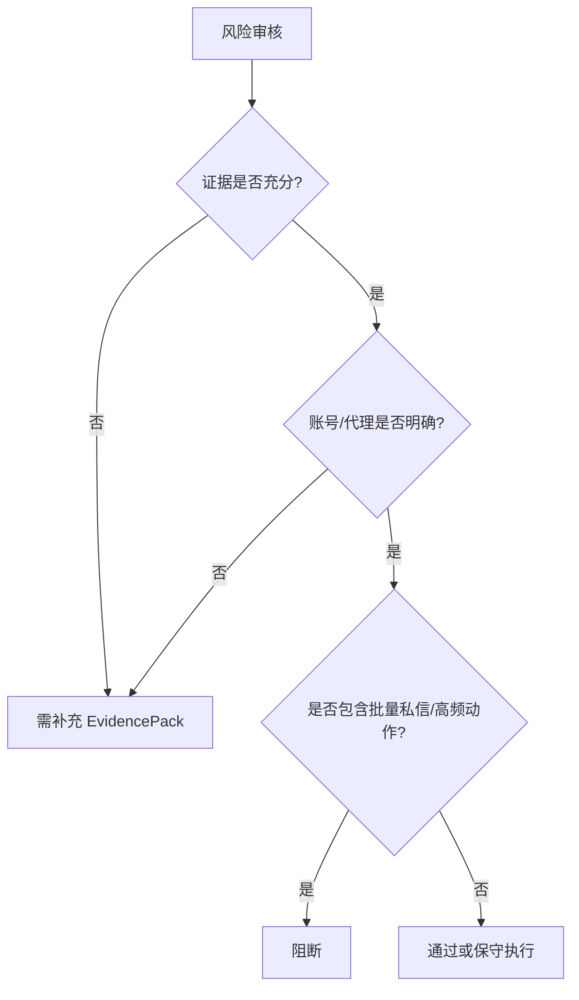

# AIvaMax 风险审核卡

<strong>AIvaMax</strong> 
风险审核卡

```mermaid
flowchart TD
  A["风险审核"] --> B{"证据是否充分?"}
  B -- "否" --> R["需补充 EvidencePack"]
  B -- "是" --> C{"账号/代理是否明确?"}
  C -- "否" --> R
  C -- "是" --> D{"是否包含批量私信/高频动作?"}
  D -- "是" --> X["阻断"]
  D -- "否" --> P["通过或保守执行"]
```
