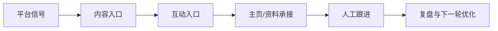

# AIvaMax Facebook 平台专项打法库

## 1. 平台打法总览
社群、主页、评论和本地信任关系驱动的平台。

## 2. 平台偏好
- Groups 主题讨论
- Page 内容沉淀
- 评论与消息线索
- 本地/兴趣社群
- 长文解释型内容

## 3. 用户画像
- 本地服务用户
- 兴趣社群成员
- B2C 消费用户
- 社群管理员与小企业主

## 4. 内容入口与转化路径
- 主要入口: Groups, Page posts, 评论区, Marketplace, Messenger
- 成交路径: 社群内容/讨论 -> 价值回复 -> 主页或页面信任 -> 用户提问 -> 人工承接。

## 5. 核心打法
- 先做社群相关性筛选
- 避免同文跨群重复发布
- 帖子与评论分开记录
- 把链接与硬转化动作放到高信任账号和人工审核后

## 6. 红黄绿风险边界
| 分层 | 含义 | 典型动作 | 处理策略 |
|---|---|---|---|
| 绿色 | 可作为公开课程与日常 SOP 的稳定动作。 | 内容准备、排程、人工审核、正常互动、每日记录、复盘。 | 继续执行，并保留记录。 |
| 黄色 | 可以做小范围验证，但必须有人审、上限和暂停条件。 | 自动化辅助、批量账号管理、评论/私信测试、外部素材导入、跨账号内容变体。 | 降级执行，先小批量测试，异常即暂停。 |
| 红色 | 不进入公开课程，不作为推荐执行动作。 | 垃圾内容、虚假互动、未经同意的高频触达、平台限制对抗、账号欺骗。 | 放弃或改写为合规的人工审核流程。 |

## 7. 课程化表达
- Facebook Groups 获客
- 主页内容排程
- 评论线索识别
- 社群规则适配

## 8. 公开课程与内部执行分工
| 层级 | 可以承载的内容 | 不承载的内容 |
|---|---|---|
| 公开课程层 | 平台逻辑、内容方法、账号安全、人审、暂停条件、复盘 | 账号批次、环境参数、异常细节、未验证实验 |
| 内部执行层 | 实验假设、账号分层、素材准备、动作记录、异常处理 | 对外销售页、公开学员讲义 |

## 9. 官方参考
- Instagram/Meta Terms: https://www.facebook.com/help/instagram/581066165581870
- Meta Community Guidelines reference: https://www.facebook.com/help/477434105621119?locale=en_GB
