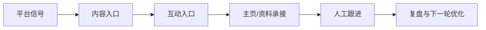

# AIvaMax Instagram 平台专项打法库

## 1. 平台打法总览
视觉信任、轻互动、主页承接和评论区信号驱动的平台。

## 2. 平台偏好
- Reels 与短视频节奏
- 评论区问题识别
- 主页信任资产
- Stories 轻触达
- 收藏与转发信号

## 3. 用户画像
- 课程/工具兴趣用户
- 内容创作者
- 小团队运营者
- 正在比较解决方案的轻咨询用户

## 4. 内容入口与转化路径
- 主要入口: Reels, 帖子评论区, Stories, 主页简介, 精选集合
- 成交路径: 内容曝光 -> 评论区价值回应 -> 主页信任判断 -> 用户主动询问 -> 人工跟进。

## 5. 核心打法
- 新号先做内容与浏览节奏
- 评论以价值补充为主
- 把私信阶段放到明确互动之后
- 每 7 天复盘一次内容支柱与账号稳定性

## 6. 红黄绿风险边界
| 分层 | 含义 | 典型动作 | 处理策略 |
|---|---|---|---|
| 绿色 | 可作为公开课程与日常 SOP 的稳定动作。 | 内容准备、排程、人工审核、正常互动、每日记录、复盘。 | 继续执行，并保留记录。 |
| 黄色 | 可以做小范围验证，但必须有人审、上限和暂停条件。 | 自动化辅助、批量账号管理、评论/私信测试、外部素材导入、跨账号内容变体。 | 降级执行，先小批量测试，异常即暂停。 |
| 红色 | 不进入公开课程，不作为推荐执行动作。 | 垃圾内容、虚假互动、未经同意的高频触达、平台限制对抗、账号欺骗。 | 放弃或改写为合规的人工审核流程。 |

## 7. 课程化表达
- 账号冷启动
- 评论区轻获客
- Reels 内容矩阵
- 主页信任资产

## 8. 公开课程与内部执行分工
| 层级 | 可以承载的内容 | 不承载的内容 |
|---|---|---|
| 公开课程层 | 平台逻辑、内容方法、账号安全、人审、暂停条件、复盘 | 账号批次、环境参数、异常细节、未验证实验 |
| 内部执行层 | 实验假设、账号分层、素材准备、动作记录、异常处理 | 对外销售页、公开学员讲义 |

## 9. 官方参考
- Instagram Terms: https://www.facebook.com/help/instagram/581066165581870
- Instagram Community Guidelines: https://www.facebook.com/help/477434105621119?locale=en_GB
