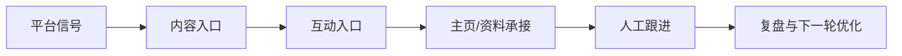

# AIvaMax LinkedIn 平台专项打法库

## 1. 平台打法总览
专业身份、内容可信度和 B2B 关系建立驱动的平台。

## 2. 平台偏好
- 专业观点内容
- 个人主页可信度
- 精准连接请求
- 评论区专业互动
- 长周期线索培育

## 3. 用户画像
- B2B 决策者
- 招聘/HR
- 创始人
- 销售负责人
- 专业服务购买者

## 4. 内容入口与转化路径
- 主要入口: 个人主页, 公司主页, 行业帖子评论, 连接请求, 私信跟进
- 成交路径: 专业内容/评论 -> 主页可信度判断 -> 连接建立 -> 人工个性化沟通 -> 预约或资料发送。

## 5. 核心打法
- 先优化个人和公司主页
- 评论必须体现专业上下文
- 连接请求低频且个性化
- 线索分层后再进入人工跟进

## 6. 红黄绿风险边界
| 分层 | 含义 | 典型动作 | 处理策略 |
|---|---|---|---|
| 绿色 | 可作为公开课程与日常 SOP 的稳定动作。 | 内容准备、排程、人工审核、正常互动、每日记录、复盘。 | 继续执行，并保留记录。 |
| 黄色 | 可以做小范围验证，但必须有人审、上限和暂停条件。 | 自动化辅助、批量账号管理、评论/私信测试、外部素材导入、跨账号内容变体。 | 降级执行，先小批量测试，异常即暂停。 |
| 红色 | 不进入公开课程，不作为推荐执行动作。 | 垃圾内容、虚假互动、未经同意的高频触达、平台限制对抗、账号欺骗。 | 放弃或改写为合规的人工审核流程。 |

## 7. 课程化表达
- B2B 线索筛选
- 专业内容矩阵
- 连接请求边界
- 人工跟进脚本

## 8. 公开课程与内部执行分工
| 层级 | 可以承载的内容 | 不承载的内容 |
|---|---|---|
| 公开课程层 | 平台逻辑、内容方法、账号安全、人审、暂停条件、复盘 | 账号批次、环境参数、异常细节、未验证实验 |
| 内部执行层 | 实验假设、账号分层、素材准备、动作记录、异常处理 | 对外销售页、公开学员讲义 |

## 9. 官方参考
- LinkedIn Prohibited Software: https://www.linkedin.com/help/linkedin/answer/a1341387/prohibited-software-and-extensions?lang=en
