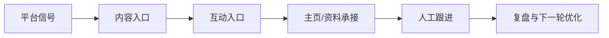

# AIvaMax TikTok 平台专项打法库

## 1. 平台打法总览
短视频兴趣分发、热点跟随和账号内容一致性驱动的平台。

## 2. 平台偏好
- 短视频完播
- 热点音频/话题
- 账号垂直标签
- 评论区需求
- 直播或橱窗承接

## 3. 用户画像
- 内容消费用户
- 兴趣标签用户
- 年轻消费群体
- 想快速理解工具/课程的人

## 4. 内容入口与转化路径
- 主要入口: For You feed, 短视频评论区, 搜索关键词, 话题标签, 主页合集
- 成交路径: 短视频触达 -> 评论或收藏信号 -> 主页连续内容验证 -> 用户主动询问 -> 人工承接。

## 5. 核心打法
- 先固定账号内容标签
- 小批量测试 3-5 个内容角度
- 评论只做上下文相关回复
- 复盘完播、评论质量和主页访问

## 6. 红黄绿风险边界
| 分层 | 含义 | 典型动作 | 处理策略 |
|---|---|---|---|
| 绿色 | 可作为公开课程与日常 SOP 的稳定动作。 | 内容准备、排程、人工审核、正常互动、每日记录、复盘。 | 继续执行，并保留记录。 |
| 黄色 | 可以做小范围验证，但必须有人审、上限和暂停条件。 | 自动化辅助、批量账号管理、评论/私信测试、外部素材导入、跨账号内容变体。 | 降级执行，先小批量测试，异常即暂停。 |
| 红色 | 不进入公开课程，不作为推荐执行动作。 | 垃圾内容、虚假互动、未经同意的高频触达、平台限制对抗、账号欺骗。 | 放弃或改写为合规的人工审核流程。 |

## 7. 课程化表达
- 短视频矩阵
- 热点筛选
- 账号标签冷启动
- 评论信号识别

## 8. 公开课程与内部执行分工
| 层级 | 可以承载的内容 | 不承载的内容 |
|---|---|---|
| 公开课程层 | 平台逻辑、内容方法、账号安全、人审、暂停条件、复盘 | 账号批次、环境参数、异常细节、未验证实验 |
| 内部执行层 | 实验假设、账号分层、素材准备、动作记录、异常处理 | 对外销售页、公开学员讲义 |

## 9. 官方参考
- TikTok Integrity and Authenticity: https://www.tiktok.com/community-guidelines/en/integrity-authenticity
- TikTok Community Guidelines: https://support.tiktok.com/en/safety-hc/account-and-user-safety/community-guidelines
