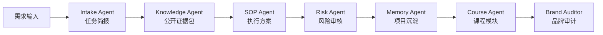
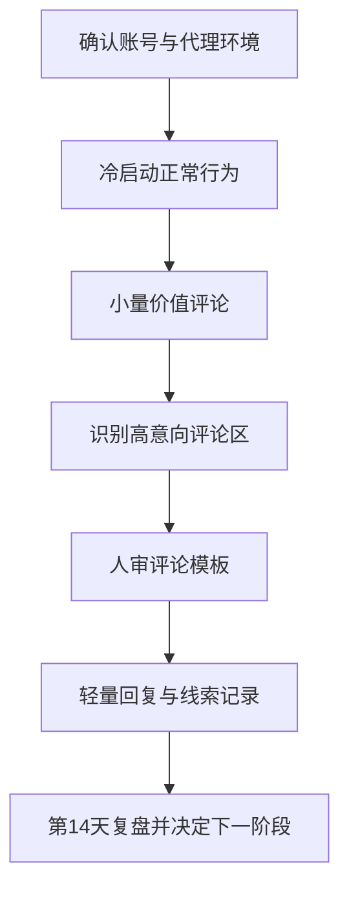
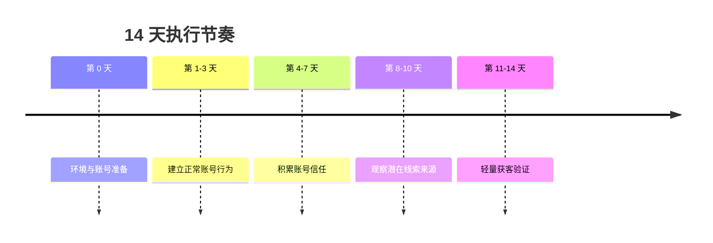
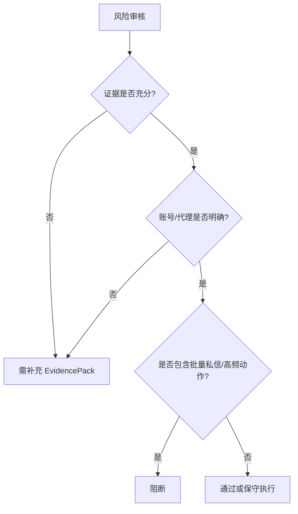
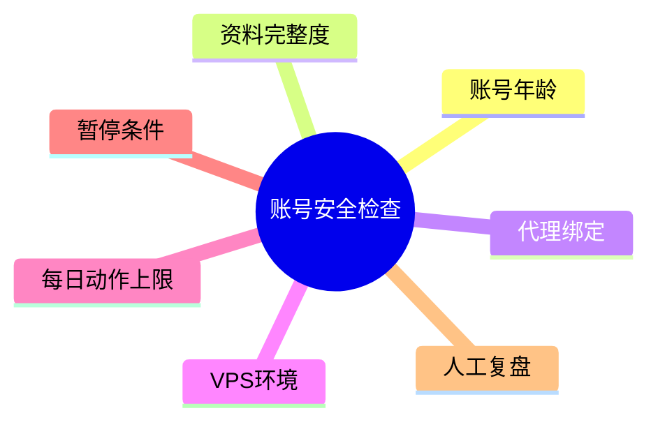

# AIvaMax 图文流程包

## 可视化流程图

### 多智能体执行链路

```mermaid
flowchart LR
  A["需求输入"] --> B["Intake Agent<br/>任务简报"]
  B --> C["Knowledge Agent<br/>公开证据包"]
  C --> D["SOP Agent<br/>执行方案"]
  D --> E["Risk Agent<br/>风险审核"]
  E --> F["Memory Agent<br/>项目沉淀"]
  F --> G["Course Agent<br/>课程模块"]
  G --> H["Brand Auditor<br/>品牌审计"]
```

### SOP 执行流程

```mermaid
flowchart TD
  A["确认账号与代理环境"] --> B["冷启动正常行为"]
  B --> C["小量价值评论"]
  C --> D["识别高意向评论区"]
  D --> E["人审评论模板"]
  E --> F["轻量回复与线索记录"]
  F --> G["第14天复盘并决定下一阶段"]
```

### 14 天节奏图

```mermaid
timeline
  title 14 天执行节奏
  第 0 天 : 环境与账号准备
  第 1-3 天 : 建立正常账号行为
  第 4-7 天 : 积累账号信任
  第 8-10 天 : 观察潜在线索来源
  第 11-14 天 : 轻量获客验证
```

### 风险审核决策图

```mermaid
flowchart TD
  A["风险审核"] --> B{"证据是否充分?"}
  B -- "否" --> R["需补充 EvidencePack"]
  B -- "是" --> C{"账号/代理是否明确?"}
  C -- "否" --> R
  C -- "是" --> D{"是否包含批量私信/高频动作?"}
  D -- "是" --> X["阻断"]
  D -- "否" --> P["通过或保守执行"]
```

### 结构示意图

```mermaid
mindmap
  root((账号安全检查))
    账号年龄
    资料完整度
    代理绑定
    VPS环境
    每日动作上限
    暂停条件
    人工复盘
```

